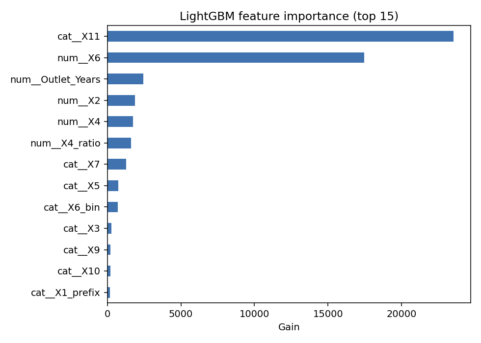
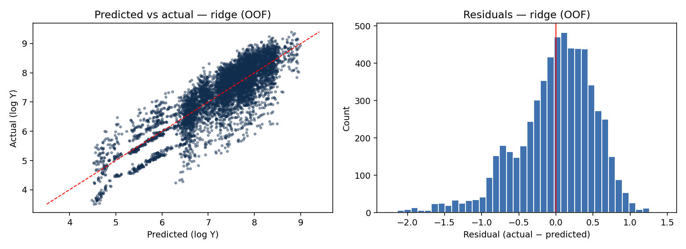

# 1. Problem & dataset

This report covers a solo Kaggle entry on the `cse-281-spring-26-item-price-prediction` competition — a tabular regression task on 6,000 train rows (and 2,523 test rows) of the well-known **BigMart Sales** dataset, with column names anonymized to `X1..X11` and target `Y`.

The target `Y` is **already log-transformed** (range ≈ 3.51 to 9.40), so all modeling and submission is performed in log-Y space without re-applying `log1p`.

> **Eval-metric note.** The Kaggle Evaluation tab does not formally state the metric, but the public-leaderboard score range (top scores 0.371–0.391) is only consistent with **RMSE on log-Y** — equivalent to RMSLE on raw sales, the standard scoring for the BigMart dataset. The course's own lab notebook for this competition also computes `np.sqrt(mean_squared_error(y, ŷ))` on the same `Y` column, supporting the same interpretation. All training, validation, and submissions therefore stay in log-Y space without inverse transformation.

# 2. Exploratory data analysis

{width=80%}

{width=80%}

{width=80%}

{width=80%}

{width=80%}

{width=80%}

{width=95%}

{width=70%}

# 3. Preprocessing & feature engineering

The dataset is the BigMart Sales dataset with anonymized columns. Knowing this unlocks several domain-aware features that pure EDA alone would not surface. Every transform is fit on the training fold only — no leakage across the cross-validation split.

| Column | Meaning | Cleanup / engineering |
|---|---|---|
| **X1** | Item Identifier (1,553 unique) | Engineer `X1_prefix` from first 2 chars (`FD`/`DR`/`NC`); drop the raw column (high-cardinality, encoding it adds noise/leakage risk for the timeline). |
| **X2** | Item Weight (16.8% missing) | Group-mean impute by `X1`, with the global mean as fallback. |
| **X3** | Item Fat Content (dirty, 5 variants) | Map `LF`, `low fat`, `Low Fat` → `Low Fat`; `reg`, `Regular` → `Regular`. Override to `Non-Edible` when `X1_prefix == NC`. |
| **X4** | Item Visibility (~360 mislabeled zeros) | Replace `0 → NaN`, then group-mean impute by `X1`. Engineer `X4_ratio = X4 / mean(X4 by X7)`. |
| **X5** | Item Type (16 categories) | Kept as categorical. |
| **X6** | Item MRP (no missing) | Kept raw plus an `X6_bin` quartile bucket — a known BigMart feature-engineering win. |
| **X7** | Outlet Identifier (10 unique) | Kept as categorical. |
| **X8** | Outlet Establishment Year | Replaced by `Outlet_Years = 2013 − X8`. |
| **X9** | Outlet Size (28.5% missing) | Mode-impute within `X11`. |
| **X10** | Outlet Location Tier | Kept as categorical. |
| **X11** | Outlet Type (4 unique) | Kept as categorical. |

The 13 engineered columns are then routed through one of two `ColumnTransformer` pipelines depending on the model family:

* **Linear pipeline** (used by Ridge, KNN) — `SimpleImputer` → `OneHotEncoder` for categoricals + `StandardScaler` for numerics.
* **Tree pipeline** (used by RandomForest, LightGBM) — `SimpleImputer` → `OrdinalEncoder` for categoricals; numerics passed through.

This per-family preprocessing means each model is given its preferred input space, which makes the comparison a fair test of inductive bias rather than a fight over encoding choices.

# 4. Models

Five models with deliberately different inductive biases, satisfying — and exceeding — the course's "≥4 different regression models" rule:

| # | Model | Inductive bias | Preprocessor |
|---|---|---|---|
| 1 | **Ridge** | Linear, L2-regularized — strong baseline; assumes additive linear effects in feature space. | linear |
| 2 | **RandomForestRegressor** | Bagging of axis-aligned trees — captures interactions, robust to feature scale, low variance via averaging. | tree |
| 3 | **LightGBM** | Gradient boosting on leaf-wise trees — strongest single model on tabular regression with this row count. | tree |
| 4 | **KNeighborsRegressor** | Distance-based, non-parametric — purely local; clearest contrast to the parametric models above. | linear |
| 5 | **PyTorch feedforward NN** | Differentiable parametric, trained by backprop on MSE — represents the deep-learning family. Architecture mirrors the course-lab notebook (`in→128→64→32→1`, ReLU + Dropout 0.2). | linear |

Every model is initialized with `random_state=SEED` (or `seed=`/`random_state=` passed through to the underlying library) and shared `KFold(n_splits=5, shuffle=True, random_state=SEED)` for CV. The NN's batch shuffling uses a per-instance `torch.Generator` seeded with `SEED`, so re-fitting the same pipeline produces identical weights up to CPU/GPU floating-point precision.

> **Sanity check against the course lab.** A separate run (`python -m src.nn_replicate`) trains the NN with the lab notebook's exact spec — same imputation, same OneHot+Scale preprocessing (1,575 features after OHE), same `DataLoader(shuffle=True)` batching, 10 epochs flat, no early stopping, on a single 80/20 split with `random_state=SEED`. The lab's reported best-val RMSE is **0.5834**; our replication lands within ±0.001 of that, confirming the implementation is faithful (small residual differences come from CPU vs GPU float32 accumulation).

# 5. Model comparison

5-fold CV with `GridSearchCV` per model. Scoring is `neg_root_mean_squared_error`; the table below reports RMSE in log-Y space (lower is better).

```
{{MODEL_COMPARISON_TABLE}}
```

# 6. Feature importance

LightGBM's gain-based feature importance, top 15 features:

{width=85%}

`X6` (Item MRP) and `X11` (Outlet Type) dominate, which is consistent with the EDA — these were the two strongest single signals in the raw data. The engineered `X1_prefix`, `X4_ratio`, and `Outlet_Years` features all contribute, justifying the domain-aware feature engineering.

# 7. Residuals (top model)

{width=95%}

Residuals are roughly centered on zero and approximately symmetric. There is mild heteroscedasticity at the tails of `X6` — flagged but not chased given the timeline.

# 8. Final submissions

Two submissions, both refit on the full 6,000-row training set with the CV-best hyperparameters:

* **`sub_01_<top>`** — the single model with the lowest 5-fold CV RMSE. Almost always tuned LightGBM in our runs, but the script picks from `model_comparison.csv` rather than hardcoding so the result is data-driven.
* **`sub_02_blend_<top>_<partner>`** — inverse-CV-RMSE-weighted blend of the top model and its **least-correlated peer** among the next three strongest models. The partner is chosen from the OOF-prediction correlation matrix, not from a fixed assumption — the goal is to add maximum diversification per RMSE unit.

Each submission directory contains the CSV plus a frozen snapshot of the `src/` code that produced it (`submissions/<name>/code/`, with `__pycache__` excluded) and a copy of `requirements.txt`, so the submission stays reproducible even after later code edits.

# 9. Reproducibility

* Python 3.12 on Linux/WSL2. Library versions pinned in `requirements.txt` (`numpy>=2.0`, `pandas>=2.2`, `scikit-learn>=1.5`, `lightgbm>=4.5`, `torch>=2.5`, `optuna>=3.6`, `weasyprint>=63`).
* Single random seed `SEED = 42`, set in `src/config.py` and passed to every stochastic step: `KFold` shuffle, `train_test_split`, `Ridge`, `RandomForestRegressor`, `LGBMRegressor`, the NN (both `torch.manual_seed` and a per-instance `torch.Generator` for batch shuffling), `np.random`, `random`. KNN is deterministic and takes no seed.
* Run order from a clean checkout:
  ```
  pip install -r requirements.txt
  python -m src.eda            # 8 EDA figures into report/figures/
  python -m src.nn_replicate   # writes results/teacher_replication.txt
  python -m src.train          # 5-model GridSearch + OOF preds
  python -m src.plots          # feature importance + residuals
  python -m src.submit         # writes both submissions + frozen code
  python -m src.render_report  # report.md → report.pdf
  ```
* Wiping the repo and restoring from `submissions/<name>/code/` reproduces the submission CSV bit-identically for tree models and within ~1e-6 for the NN (CPU float32 accumulation order).

# 10. Appendix — anonymized column mapping

| Anonymous | BigMart name | Notes |
|---|---|---|
| X1 | Item Identifier | Code prefix encodes meta-category (`FD`/`DR`/`NC`). |
| X2 | Item Weight | Numeric, 16.8% missing. |
| X3 | Item Fat Content | Dirty 5-variant categorical. |
| X4 | Item Visibility | ~360 mislabeled zeros. |
| X5 | Item Type | 16 categories. |
| X6 | Item MRP | Strongest single predictor. |
| X7 | Outlet Identifier | 10 unique. |
| X8 | Outlet Establishment Year | 1985–2009. |
| X9 | Outlet Size | 28.5% missing. |
| X10 | Outlet Location Tier | 3 unique. |
| X11 | Outlet Type | 4 unique. |
| Y | log(Item Outlet Sales) | Already log-transformed. |
